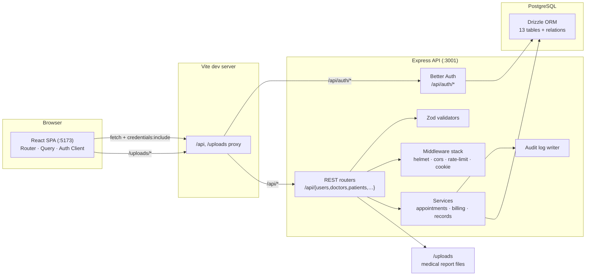
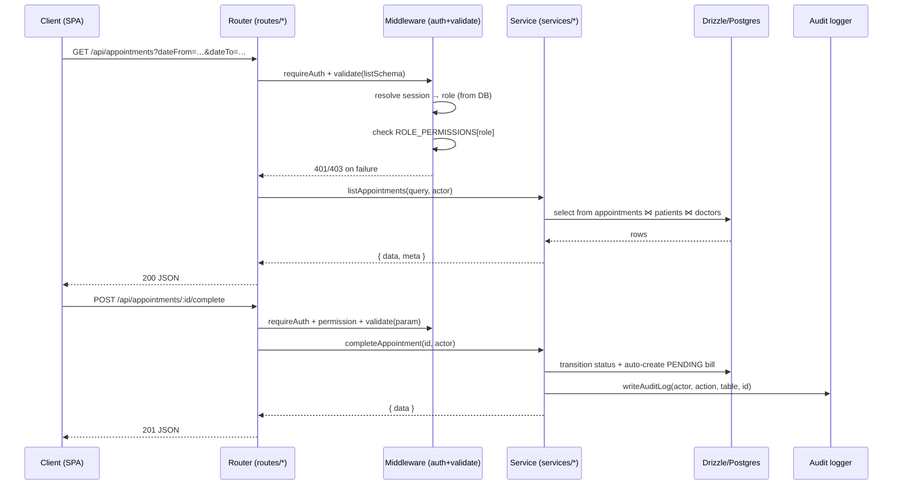
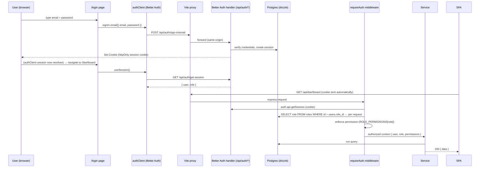

# NexaCare — Architecture

This document explains how NexaCare is built, how the backend and frontend interact, and how authentication and the core workflows work.

---

## 1. System overview

NexaCare is a **classic client–server monorepo**:

- **`apps/front-end`** — a React 19 SPA served by Vite. In dev it proxies `/api` and `/uploads` to the API, so the browser only ever talks to the SPA origin (no CORS friction, single domain).
- **`apps/back-end`** — an Express 5 REST API. It handles authentication (Better Auth), business logic (services), validation (Zod) and persistence (Drizzle + PostgreSQL). Uploaded report files are served statically from `/uploads`.



---

## 2. Repository skeleton at a glance

```mermaid
flowchart TD
    ROOT["HMS (Bun workspace)"]

    ROOT --> BE["apps/back-end"]
    BE --> BE1["index.ts — bootstrap"]
    BE --> BE2["src/auth — Better Auth + role resolution"]
    BE --> BE3["src/routes — REST routers"]
    BE --> BE4["src/middleware — auth(RBAC) · validate · errors"]
    BE --> BE5["src/services — business logic + audit"]
    BE --> BE6["src/validators — Zod request schemas"]
    BE --> BE7["src/database — Drizzle schema · migrations · seed"]
    BE --> BE8["src/config — env + DB pool"]
    BE --> BE9["drizzle — generated SQL migrations"]

    ROOT --> FE["apps/front-end"]
    FE --> FE1["src/router.tsx — typed routes"]
    FE --> FE2["src/pages — 1 component per route"]
    FE --> FE3["src/components/ui — design-system primitives"]
    FE --> FE4["src/components/layout — AppShell · global search"]
    FE --> FE5["src/lib — api client · auth-client · helpers"]
    FE --> FE6["vite.config.ts — dev proxy"]

    ROOT --> SPEC["index.ts — original requirements spec"]
```



**Backend request path**: `route → middleware (auth + validate) → service → Drizzle/Postgres → response` (+ audit log on every mutation).

**Frontend data path**: `page → TanStack Query → lib/api (fetch) → backend → typed JSON → page`.

---

## 3. Backend architecture

### 3.1 Bootstrap (`apps/back-end/index.ts`)

Ordered middleware stack:

1. `helmet()` — security headers
2. `cors({ origin: env.CORS_ORIGINS, credentials: true })`
3. `compression()` + `express.json/urlencoded` + `cookieParser()`
4. `rateLimit()` — 300 req / 15 min, **skips `/api/auth/*`** (Better Auth rate-limits those itself)
5. `GET /health` — liveness probe
6. `Better Auth handler` at `/api/auth/*`
7. Domain router at `/api`
8. Static files at `/uploads`
9. `notFoundHandler` → `errorHandler`

### 3.2 Request lifecycle (per endpoint)



### 3.3 The three middleware concerns

- **`requireAuth`** — resolves the caller from the Better Auth session cookie, loads the user + role **from the database on every request** (so role changes take effect immediately, not at session expiry). Exposes `req.auth` (`{ user, role, permissions }`).
- **`requirePermission / requireOwnershipOr`** — RBAC checks against `ROLE_PERMISSIONS` (e.g. a doctor may only mutate their own appointments; an admin may do anything). Doctors can read/modify records they own.
- **`validate / validated`** — parses and type-coerces `body`, `query` and `params` against the Zod schemas in `src/validators` before the service runs.

### 3.4 Services

Each resource has a service module (`src/services/*.ts`) that owns the business rules:

- **Appointments** — no past dates, no double-booking, and a strict state machine:

```
        ┌──────────┐  check-in   ┌─────────────┐  start   ┌─────────────┐  complete   ┌────────────┐
        │ SCHEDULED │───────────→│ CHECKED_IN   │─────────→│ IN_PROGRESS  │───────────→│  COMPLETED │
        └──────────┘             └─────────────┘           └─────────────┘             └────────────┘
              │                       │                       │
              ├─cancel───────────────┼───────────────────────┘
              └─no-show──────────────┘
```

`COMPLETED` and `CANCELLED` appointments are immutable (cannot be rescheduled). Completing an appointment **auto-creates a PENDING bill**.

- **Bills** — `PENDING → PARTIALLY_PAID → PAID` with recorded payments; `CANCELLED` / `REFUNDED` as terminal states.
- **Medical records** — created against a patient, optionally bound to a doctor; diagnosis / prescription / treatmentPlan are updatable; a PDF report can be uploaded and is served from `/uploads`.
- **Audit logging** — every mutating service writes an `audit_logs` row (`actorId`, `action`, `tableName`, `recordId`, diff, `ipAddress`).

### 3.5 Data model

Drizzle tables in `src/database/schema`:

```
users (auth) ──< sessions / accounts / verifications (auth)
users │ 1:1 doctors            users │ 1:1 patients
patients ──< appointments >── doctors
patients ──< medical_records >── doctors
patients ──< bills
users ──< audit_logs
```

Roles are a static lookup table (`SUPER_ADMIN, ADMIN, DOCTOR, RECEPTIONIST, ACCOUNTANT, PATIENT`) referenced by `users.roleId`.

---

## 4. Frontend architecture

### 4.1 Entry point

`main.tsx` wraps the app in `QueryClientProvider` + `RouterProvider`, plus a Sonner `<Toaster />`.

`router.tsx` defines a typed tree: a public `/login` route and a layout route (`/app`) rendered by `AppShell`, whose children are the protected pages. Search params are validated too (`/patients` and `/doctors` accept `?search=`). Route access itself is enforced **inside `AppShell`** by rendering a role-specific nav (routes aren't individually guarded).

### 4.2 Page anatomy

A typical page (e.g. `pages/appointments.tsx`):

1. **State + URL sync** — `useSearch`/`useNavigate` for shared search, local `useState` for page/filters.
2. **Data** — `useQuery({ queryKey, queryFn })` calling `api.get<Paginated<T>>("/api/…", params)`.
3. **Mutations** — `useMutation` calling `api.post/patch/delete`, invalidating the query on success.
4. **UI** — the shared design-system primitives in `components/ui` (Card, Table, Modal, Badge, Field, Button, Pagination, SortableTh, StatCard, PageHeader/Spinner/EmptyState/InlineError).

`lib/api.ts` is a thin typed fetch wrapper: JSON headers, `credentials: "include"`, automatic query-string building, and normalized `ApiError` thrown from the backend error envelope.

`lib/auth-client.ts` wraps Better Auth's React client (`useSession`, `signIn.email`, `signOut`).

### 4.3 Role-based UI

`AppShell` switches nav items by `role`:

| Role              | Nav                                                                                                      |
| ----------------- | -------------------------------------------------------------------------------------------------------- |
| Admin/SUPER_ADMIN | Dashboard, Patients, Doctors, Appointments, Calendar, Medical Records, Bills, Reports, Users, Audit Logs |
| Doctor            | Dashboard, Calendar, Medical Records, Doctor Profile                                                     |
| Receptionist      | Dashboard, Patients, Appointments, Calendar, Medical Records, Bills                                      |
| Accountant        | Receptionist nav + Reports                                                                               |

---

## 5. Authentication flow (RBAC)



Key security points:

- Sessions are **httpOnly cookies**; the SPA never touches the token directly.
- The **role is re-read from the database on every request** — a demoted user loses access immediately.
- **RBAC is enforced server-side**; the frontend nav is only a UX layer.
- Public sign-up is disabled by default (`ALLOW_PUBLIC_SIGNUP=false`) — accounts are seeded or created by an admin.

---

## 6. Frontend ↔ Backend contract

### Responses

| Kind              | Shape                                                     |
| ----------------- | --------------------------------------------------------- |
| List              | `{ data: T[], meta: { page, limit, total, totalPages } }` |
| Single / mutation | `{ data: T }`                                             |
| No content        | `204`                                                     |
| Error             | `{ error: { code, message, details? } }`                  |

Statuses: `400` validation, `401` unauthenticated, `403` forbidden, `404` not found, `409` conflict (e.g. double-booking, illegal state transition).

### Pagination & filtering

Every list endpoint accepts `page` and `limit` (max **100**). Appointments additionally support `status`, `patientId`, `doctorId`, `dateFrom`, `dateTo` and `includeDeleted`. Patients and doctors support `search` and `status`.

### Cross-cutting behaviors

- All mutations run through the audit logger.
- Appointment status transitions are state-machine guarded and return `409` on illegal moves.
- Reports, dashboards and the calendar are all derived **client-side** from the same REST endpoints (`/api/dashboard`, `/api/bills`, `/api/appointments`) — there is no separate reporting backend.

---

## 7. Running it

| Component    | Command                            | URL                          |
| ------------ | ---------------------------------- | ---------------------------- |
| Backend      | `cd apps/back-end && bun run dev`  | <http://localhost:3001>        |
| Frontend     | `cd apps/front-end && bun run dev` | <http://localhost:5173>        |
| Health check |                                    | <http://localhost:3001/health> |

Dev-only notes:

- The Vite proxy forwards `/api` and `/uploads` to `:3001`, so CORS is effectively moot in development.
- Seeded demo credentials are listed in the root [README](./README.md).
